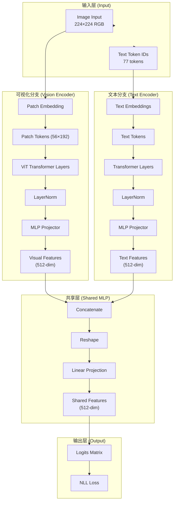

# CLIP 网络架构

**Contrastive Language-Image Pre-training**

## 架构图

## 关键参数

| 组件 | 参数量 | 说明 |
|------|--------|------|
| **Vision Encoder** | 87.6M | ViT-Base with Patch32 |
| **Text Encoder** | 63.8M | Transformer LM |
| **总计** | 151M | CLIP-B/32 模型 |

## 输入/输出维度

- **图像输入**: 224×224 RGB 图像
- **文本输入**: Tokenized text, 最大 77 tokens (包括 CLS + EOS)
- **Embedding 维度**: 512
- **词汇表大小**: 49,408 (CLIP-B/32)
- **Patch 数量**: 56 (224² ÷ 32²)
- **Patch 维度**: 192

## 训练目标

**对比学习 (Contrastive Learning)**

给定的 (图像, 文本) 对批次：

1. **编码**: 视觉编码器 → visual embeddings, 文本编码器 → text embeddings
2. **投影**: 共享的 MLP 投影到 512 维特征空间
3. **计算**: logits_{i,j} = (v_i · w_j)^T / temperature
4. **CLS 位置**: i=0 给出匹配对的正例概率
5. **负例**: 所有其他位置都是负例
6. **损失**: 交叉熵损失，最大化正确对的概率

## 架构特点

- **双分支编码器**: 分离的视觉和文本编码器
- **对比预训练**: 学习图像-文本对齐
- **零样本迁移**: 可用于图像到文本、文本到图像检索
- **ViT Transformer**: 全局注意力，处理整个图像作为序列

## 参考实现

- **论文**: OpenAI CLIP (Radford et al., 2021)
- **代码**: `transformers.ClipModel`, `clip_train.py`, `clip_test.py`