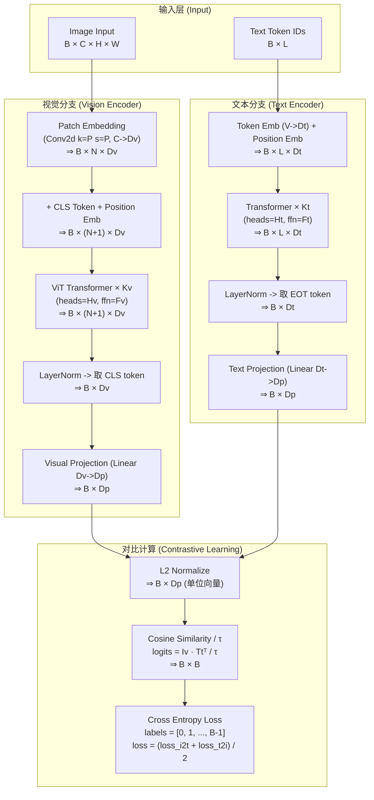

# CLIP 网络架构

**Contrastive Language-Image Pre-training**

## 架构图



## 符号说明

| 符号 | 含义 | CLIP-B/32 取值 |
| ---- | ---- | -------------- |
| B | Batch size | 32 (clip_train.py Config) |
| C | 图像通道数 | 3 (RGB) |
| H × W | 图像尺寸 | 224 × 224 |
| P | Patch 大小 | 32 |
| N | Patch 数量 (H/P × W/P) | 49 (7 × 7) |
| L | 文本最大长度 | 77 (含 SOT + EOT) |
| V | 词汇表大小 | 49,408 |
| Dv | Vision hidden dim | 768 |
| Dt | Text hidden dim | 512 |
| Dp | Projection dim (共享空间) | 512 |
| Kv | Vision Transformer 层数 | 12 |
| Kt | Text Transformer 层数 | 12 |
| Hv | Vision attention heads | 12 |
| Ht | Text attention heads | 8 |
| Fv | Vision FFN dim | 3072 |
| Ft | Text FFN dim | 2048 |
| τ | 温度系数 | 0.07 |

## 关键参数

| 组件 | 参数量 | 说明 |
| ---- | ------ | ---- |
| **Vision Encoder** | 87.6M | ViT-Base/32 (Kv layers, Dv hidden, Hv heads) |
| **Text Encoder** | 63.8M | Transformer (Kt layers, Dt hidden, Ht heads) |
| **Visual Projection** | 0.39M | Linear Dv -> Dp |
| **Text Projection** | 0.26M | Linear Dt -> Dp |
| **总计** | ~151M | CLIP-B/32 模型 |

## 各层维度详解

### Vision Encoder 数据流

```text
pixel_values:   B × C × H × W
    ↓ Conv2d(C, Dv, kernel=P, stride=P)
patch_emb:      B × N × Dv
    ↓ prepend CLS token + add position embeddings
tokens:         B × (N+1) × Dv
    ↓ Transformer × Kv (MultiHeadAttn + FFN)
hidden:         B × (N+1) × Dv
    ↓ LayerNorm -> 取 [CLS] token (index 0)
pooled:         B × Dv
    ↓ Linear(Dv, Dp)
image_features: B × Dp
```

### Text Encoder 数据流

```text
input_ids:      B × L
    ↓ Token Embedding(V, Dt) + Position Embedding(L, Dt)
embeddings:     B × L × Dt
    ↓ Transformer × Kt (CausalAttention + FFN)
hidden:         B × L × Dt
    ↓ LayerNorm -> 取 [EOT] token 位置
pooled:         B × Dt
    ↓ Linear(Dt, Dp)
text_features:  B × Dp
```

### 对比损失计算 (对应 clip_train.py ContrastiveLoss)

```text
image_features: B × Dp  ⇒  L2 normalize  ⇒  B × Dp
text_features:  B × Dp  ⇒  L2 normalize  ⇒  B × Dp
    ↓
logits_per_image = image_features @ text_features.T / τ  ⇒  B × B
logits_per_text  = logits_per_image.T                    ⇒  B × B
labels = [0, 1, 2, ..., B-1]
loss = (CE(logits_per_image, labels) + CE(logits_per_text, labels)) / 2
```

## 训练目标

**对比学习 (Contrastive Learning)**

给定 B 个 (图像, 文本) 配对：

1. **编码**: 视觉编码器提取 image_features (B×Dp), 文本编码器提取 text_features (B×Dp)
2. **归一化**: 两组特征分别 L2 归一化为单位向量
3. **相似度**: 计算 B×B 的余弦相似度矩阵, 除以温度系数 τ
4. **标签**: 对角线位置 (i, i) 为正样本对, 其余为负样本对
5. **损失**: 对图像->文本 和 文本->图像 两个方向分别计算交叉熵, 取平均

## 架构特点

- **双塔编码器**: 独立的视觉 (ViT) 和文本 (Transformer) 编码器, hidden dim 不同 (Dv vs Dt)
- **线性投影对齐**: 通过各自的 Linear Projection 映射到共享的 Dp 维空间
- **对比预训练**: 在 batch 内构造正负样本对, 学习图像-文本对齐
- **零样本迁移**: 推理时可直接计算任意图像-文本对的相似度, 无需微调

## 参考实现

- **论文**: Learning Transferable Visual Models From Natural Language Supervision (Radford et al., 2021)
- **代码**: `transformers.CLIPModel`, `clip_train.py`, `clip_test.py`
